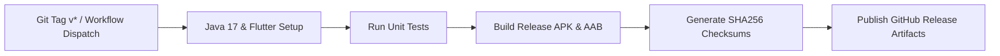

# Ezan Hatırlatıcı — Islamic Prayer Times & Life Assistant 🕌

<p align="center">
  
</p>

<p align="center">
  <a href="https://github.com/eekilinc/EzanApp/releases/latest"></a>
  <a href="https://github.com/eekilinc/EzanApp/actions/workflows/release.yml"></a>
  
  
  
  
</p>

<p align="center">
  <strong>Namaz vakitlerini takip edin, insan sesli ezan ve kişiselleştirilmiş bildirimler alın.</strong><br>
  Android ve iOS için Flutter & Material 3 ile geliştirilmiş, çevrimdışı önbellekli ve tam donanımlı İslami yaşam asistanı.
</p>

<p align="center">
  <a href="https://github.com/eekilinc/EzanApp/releases/latest"><strong>↓ Son Final APK'yı İndir (v5.0.0)</strong></a>
  · <a href="#-kurulum-ve-kullanım">Kurulum</a>
  · <a href="RELEASE_NOTES.md">Sürüm Notları</a>
  · <a href="#-android-imzalaması-app-signing">İmzalama</a>
  · <a href="#-teknik-mimari-ve-altyapı">Mimari</a>
  · <a href="https://github.com/eekilinc/EzanApp/issues">Geri Bildirim</a>
</p>

---

> 🕌 **Tamamen Ücretsiz, Reklamsız ve Açık Kaynaklı.**
> Kullanıcı verilerini izlemez; tüm konum, takvim ve bildirim ayarları cihazınızda yerel olarak saklanır.

---

## 🌟 Neler Sunuyor?

Ezan Hatırlatıcı, sıradan vakit uygulamalarının ötesinde, her vakit için bağımsız bildirim zamanlaması, gerçek dünya ezanları, donanımsal kıble pusulası, dokunsal zikirmatik ve manuel vakit tolerans motoru sunar.

| Modül / Özellik | Nasıl Çalışır ve Ne Sağlar? |
|---|---|
| ⏱️ **Manuel Tolerans (Offset)** | Her vakit için (Sabah, Güneş, Öğle, İkindi, Akşam, Yatsı) yerel cami veya takviminize göre `+/- 15` dakikaya kadar ince ayar yapabilme. |
| 📊 **Canlı İlerleme Göstergesi** | Bir sonraki vakte kalan süreyi ve mevcut vakit aralığının tamamlanma yüzdesini gösteren canlı dinamik ilerleme çubuğu. |
| 🕌 **5 Dünya Ezanı & Manevi Tonlar** | Mekke 🕋, Medine 🕌, İstanbul 🇹🇷, Mısır (Kahire) 🇪🇬 ve Mescid-i Aksa (Kudüs) 🇵🇸 makamlarında gerçek ezan okumaları; Ney, Çağrı müziği ve Salavat tonları. |
| 🔔 **Dinamik Bildirim Sistemi** | 5 vakit için ayrı ayrı 0-60 dakika öncesi/sonrası bağımsız hatırlatıcılar ve AlarmClock düzeyinde tam zamanlı bildirim kanalları. |
| 🌙 **Sahur & Cuma Uyarıları** | İmsak'a 45 dakika kala Sahur & Teheccüd uyarısı; Cuma günleri öğleden 1 saat önce mübarek Cuma hatırlatması. |
| 🧭 **Donanımsal Kıble Pusulası** | `FlutterCompass` manyetometre sensör akışı, yumuşatılmış pusula açısı ve tam Kabe yönünde dokunsal titreşim (HapticFeedback). |
| 📿 **Dokunsal Zikirmatik** | 33, 99 ve Serbest modlu; Arapça metin, okunuş, mealler ve hedef tamamlandığında titreşimli uyarı. |
| 📖 **Dualar & Sureler** | Namaz duaları, günlük dualar, Kuran'dan dualar; Arapça orijinal metin, Türkçe meal ve sesli dinleme. |
| 📅 **Hicri & Dini Günler Takvimi** | Kandiller, Ramazan, Kadir Gecesi ve bayramlar için canlı kalan gün sayacı ve aylık namaz takvimi. |
| ⚡ **0ms Çevrimdışı Önbellek** | Bellek içi + SharedPreferences çift katmanlı önbellek; internetsiz ortamda bile 30 günlük verilerle anında açılış. |
| 🎨 **PRO Temalar & Material 3** | Sistem, Açık ve Koyu mod; Zümrüt, Safir, Turkuaz, Lal ve Kehribar renk paletleri. |
| 🌍 **Çift Dil Desteği** | Türkçe 🇹🇷 ve İngilizce 🇬🇧 tam kapsamlı dil sözlüğü. |

---

## 🎉 5.0 ile Gelen Yenilikler

Kalıcı paket ve imza korunur; önceki sürümleri kaldırmadan doğrudan güncelleyebilirsiniz:

- ⏱️ **Namaz Vakti Manuel Tolerans (Offset) Motoru:** Bölgesel farklılıklar veya yerel cami saatleri için her vakte bağımsız `+/- 15 dk` ekleyebilme/çıkarabilme.
- 📊 **Canlı Vakit İlerleme Çubuğu:** Ana sayaç kartında vakit aralığının ne kadarının tamamlandığını gösteren canlı bar.
- 🎨 **Modernize Edilmiş Vakit Kartları:** Glow parıltı efektleri, tolerans rozetleri ve dinamik renk uyumu.
- 🔐 **Gelişmiş Android Release İmzalaması:** Hem yerel `key.properties` hem de GitHub Secrets üzerinden CI/CD imzalı APK & Google Play hazır AAB üretimi.
- 🚀 **GitHub Actions CI/CD:** Her sürüm için otomatik APK, AAB ve SHA256 sağlama toplamı yayınlama iş akışı.
- 🏷️ **Zenginleştirilmiş Dokümantasyon ve Yeni Birim Testleri**.

---

## 📦 Kurulum ve Kullanım

### 1. Kullanıcılar İçin (APK İndirme)
1. **[Son Final Sürümünü](https://github.com/eekilinc/EzanApp/releases/latest)** açın.
2. `EzanApp-v5.0.0.apk` dosyasını telefonunuza indirin ve kurun.
3. Uygulamayı açtığınızda GPS izni verin veya listeden şehrinizi seçin.

### 2. Geliştiriciler İçin (Kaynak Koddan Derleme)

#### Gereksinimler:
* Flutter SDK (v3.38+ / Dart 3.10+)
* Android SDK (API 34+)
* Java JDK 17

```bash
# Depoyu klonlayın
git clone https://github.com/eekilinc/EzanApp.git
cd EzanApp

# Bağımlılıkları yükleyin
flutter pub get

# Testleri çalıştırın
flutter test

# Hata ayıklama modunda çalıştırın
flutter run
```

---

## 🔐 Android İmzalaması (App Signing)

### 1. Yerel Keystore Üretimi
Projede hazır bulunan betiği çalıştırarak imzalama anahtarınızı ve `key.properties` dosyanızı tek adımda oluşturabilirsiniz:

```bash
chmod +x scripts/generate_keystore.sh
./scripts/generate_keystore.sh
```

Veya manuel olarak:
```bash
keytool -genkey -v -keystore android/app/upload-keystore.jks -alias upload -keyalg RSA -keysize 2048 -validity 10000
```

`android/key.properties` dosyasını oluşturun:
```properties
storePassword=PAROLANIZ
keyPassword=PAROLANIZ
keyAlias=upload
storeFile=upload-keystore.jks
```

### 2. İmzalı Paketleri Derleme

```bash
# Doğrudan cihaza yüklenebilir Release APK
flutter build apk --release

# Google Play Store için Release App Bundle (AAB)
flutter build appbundle --release
```

---

## 🛠️ Teknik Mimari ve Altyapı

```
lib/
├── 🎯 main.dart                  # Uygulama başlangıcı, bildirim kanalları ve tema kurulumu
├── 📦 models/                   # Veri modelleri (PrayerTimes, LocationData, DailyContent, IslamicEvent)
├── 🔄 providers/                # Reaktif State Management (PrayerProvider, SettingsProvider)
├── ⚙️ services/                 # Servisler (API, Bildirim, Ses, Konum, Kıble, Hicri, Widget)
├── 📱 screens/                  # 10 adet zengin arayüz ekranı
├── 🧩 widgets/                  # Yeniden kullanılabilir modern UI bileşenleri
└── 📝 constants/                # Çift dilli lokalizasyon sözlüğü ve sabitler
```

* **API İstemcisi:** [Aladhan REST API](https://aladhan.com) (`method=13` Diyanet, MWL, ISNA, Makkah vb.).
* **Bildirim Motoru:** `flutter_local_notifications` ile Android Notification Channels (`Importance.max`, `AudioAttributesUsage.alarm`).
* **Kıble Hesaplama:** Küresel Trigonometri (Great-Circle Distance & Bearing) algoritması ile True North kerte açısı.
* **Hicri Takvim:** Kuveyt astronomik algoritması ile Miladi <-> Hicri takvim dönüşümü.

---

## 🤖 GitHub Actions CI/CD Pipeline

Projede yer alan `.github/workflows/release.yml` iş akışı tam otomatiktir:



---

## 📄 Lisans

Bu proje **[MIT Lisansı](LICENSE)** kapsamında özgür bir yazılımdır. Ticari veya kişisel amaçlarla özgürce kullanılabilir, kopyalanabilir ve dağıtılabilir.

---

<p align="center">
  Geliştirici: <strong><a href="https://github.com/eekilinc">Emirhan Kılınç (@eekilinc)</a></strong><br>
  Made with ❤️ for the Muslim Community
</p>
